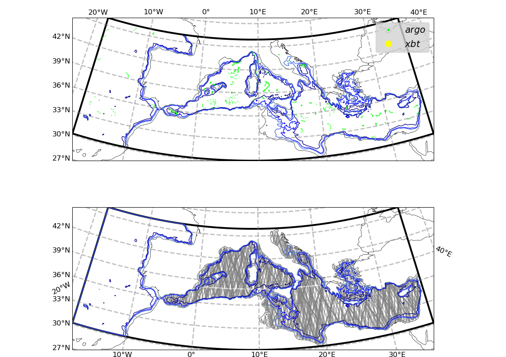
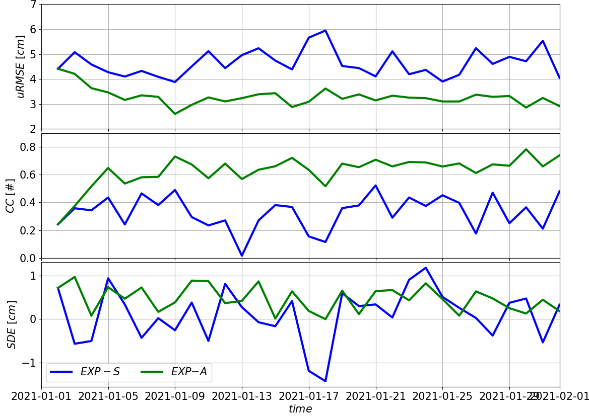
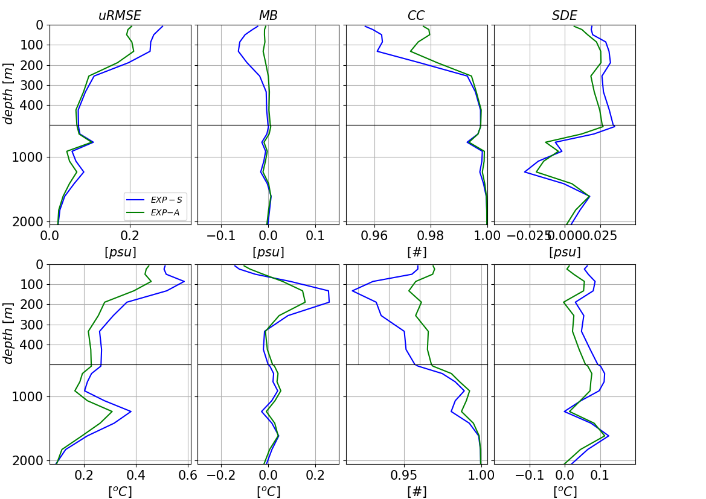

# OceanVar2 Test case
This repository provides all the needed files and a step-by-step guide on how to use OceanVar2 in the Mediterranean Sea, using the [NEMO](https://www.nemo-ocean.eu/)  model.

## To run the test case, you need

   * 
   * 

 *  (or similar to manage python packages)
 * A fortran Compiler and the required modules on a cluster (see below)

## The Python packages required to run the Test Case are:

- sys
- netCDF4
- numpy
- glob
- cftime
- datetime
- copy
- scipy 
- cartopy
- matplotlib
- ssl
- urllib
- dateutil
- warnings
- os
- xarray
- shutil
- csv
- subprocess
- re
- [ttide_py](https://github.com/moflaher/ttide_py)
- [gsw-Python](https://teos-10.github.io/GSW-Python/)

## The System libraries required to run the Test Case are:
- HDF5
- NetCDF-C 
- NetCDF-fortran
- parallel NetCDF
- curl
- perl
- nco
- cdo 
- fortran compiler

# Installation

First step, is to load the needed modules in a cluster or the PC you are using

### LOAD ENVIRONMENT
#### The following is an example on modules needed on our cluster

module load anaconda/3-2022.10

module load impi-2021.6.0/2021.6.0

module load intel-2021.6.0/libszip/2.1.1-tvhyi 

module load oneapi-2022.1.0/2022.1.0 

module load oneapi-2022.1.0/mkl/2022.1.0 

module load intel-2021.6.0/impi-2021.6.0/hdf5-threadsafe/1.13.3-zbgha

module load intel-2021.6.0/impi-2021.6.0/netcdf-c-threadsafe/4.9.0-wpe4t

module load intel-2021.6.0/impi-2021.6.0/netcdf-fortran-threadsafe/4.6.0-75oow

module load intel-2021.6.0/impi-2021.6.0/parallel-netcdf/1.12.3-eshb5

module load intel-2021.6.0/curl/7.85.0-djjip

module load intel-2021.6.0/perl/5.36.0-jj4hw

module load intel-2021.6.0/perl-uri/1.72-6at2i

module load intel-2021.6.0/nco/5.0.6-jp6y4 

module load intel-2021.6.0/cdo-threadsafe

### USAGE STEPS 

Download locally the test case input files in "MedFS831"

    git clone -b main git@github.com:CMCC-Foundation/MedFS831.git MedFS831

move the the new directory

    cd MedFS831

Download the NEMO model

    git clone --branch 4.2.0 https://forge.nemo-ocean.eu/nemo/nemo.git  medsea-nemo42

Copy the architecture file to compile NEMO

    cp MyNEMO/MY_ARCH/arch-X64_JUNO.fcm medsea-nemo42/arch/.

*EDIT: possibly modify arch-X64_JUNO.fcm according to computer architecture*

Copy the bash script provided with the test case to compile NEMO in the proper directory

     cp MyNEMO/MY_INSTALL/run_makenemo.bsh medsea-nemo42/.

-- EDIT: XIOS path in medsea-nemo42/run_makenemo.bsh

    vi medsea-nemo42/run_makenemo.bsh
Move to the proper directory and compile NEMO

    cd medsea-nemo42
    sh run_makenemo.bsh

Copy the bash script provided with the test case to compile NEMO tools in the proper directory

    cp ../MyNEMO/MY_INSTALL/run_maketools.bsh tools/.

-- EDIT: XIOS path in tools/run_maketools.bsh 

    vi tools/run_maketools.bsh

Move in the proper directory and compile

    cd tools
    sh run_maketools.bsh

Now create the NEMO Mediterranean Configuration

        cd DOMAINcfg
        cp  ../../../MyNEMO/MY_NAMELIST/namelist_cfg_MedFS831_dom namelist_cfg
        ln -fs ../../../DATA/STATIC/bathy_meter.nc .
        ./make_domain_cfg.exe
        cd ../../../MyTOOLS/BDY_NEMO
        python mk_bdycoords.py

Execute the first NEMO run (1 day) needed for some static files

    cd ../../SCRIPT/

Edit the submission script

     vi submit_MedFS831.bsh
        date_end=20210101
        OCEANVAR=false
        ln_obsmisfits=false
       
and submit (or execute in you PC)

     bsub < submit_MedFS831.bsh

 Create OceanVar2 static geometric files

    cd  ../MyTOOLS/COAST_DIST
    ./compile.bsh
    ./cstdst.x
    cd ../GRD_OCEANVAR
    python mk_oceanvar_grd.py

Prepare the observations 

    cd ../OBS_NEMO
    bsub < run_prep.bsh

Download locally the OceanVar2 code

     cd ../../
     git clone -b main git@github.com:CMCC-Foundation/OceanVar2 oceanvar2

Compile OceanVar2

    cd  oceanvar2/src
    ./link_in_work
    cd ../work/
    make all

Execute the NEMO analysis (1 month)

    cd ../../SCRIPT/

Edit the submission script for the analysis (OCEANVAR=true)

    vi submit_MedFS831.bsh
      date_end=20210131
      OCEANVAR=true
      ln_obsmisfits=true

and submit (or execute in you PC)
      
    bsub < submit_MedFS831.bsh

Edit the submission script for the simulation (OCEANVAR=false)

    vi submit_MedFS831.bsh
      date_end=20210131
      OCEANVAR=false
      ln_obsmisfits=true
      
and submit (or execute in you PC)

    bsub < submit_MedFS831.bsh

Group the misfit files into daily files

    cd ../MyTOOLS/POST
    
Edit the Python script to processing simulation misfits

    vi submit_aggregate_NemoMisfits.bsh
      analysis=false
      
and submit (or execute in you PC)

    bsub < submit_aggregate_NemoMisfits.bsh

Edit the Python script to processing analysis misfits

    vi submit_aggregate_NemoMisfits.bsh
    analysis=true

and submit (or execute in you PC)
    
    bsub < submit_aggregate_NemoMisfits.bsh
 
Compute the misfits

    python cmp_misfits_ins.py
    python cmp_misfits_sla.py

Create the figures

    python  mk_figure01.py
    python  mk_figure04.py
    python  mk_figure06.py

If everything works fine you will obtain these figures.

 

 
 

 
 

 
